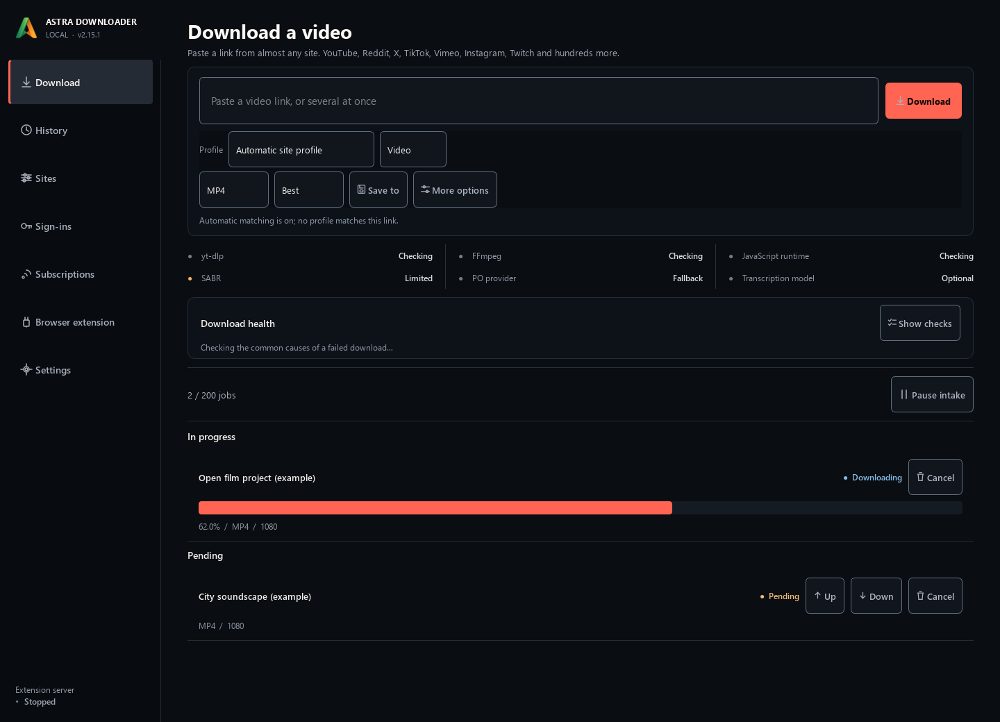
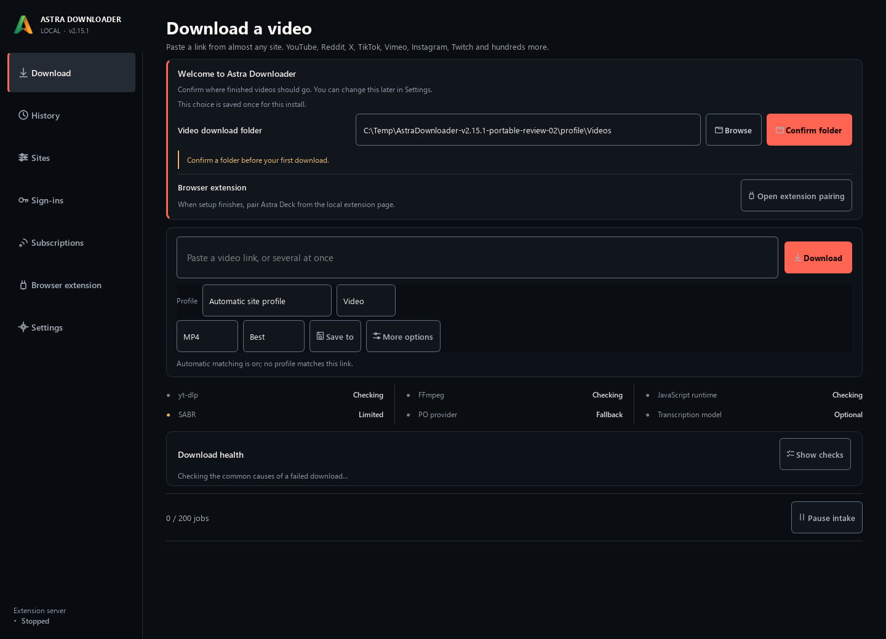
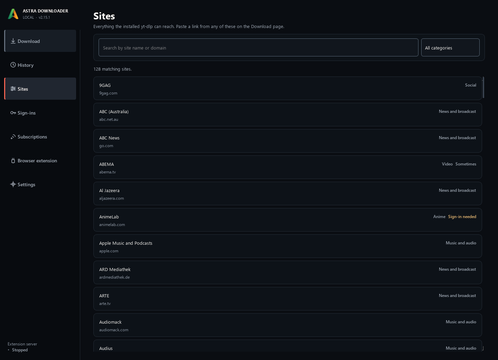
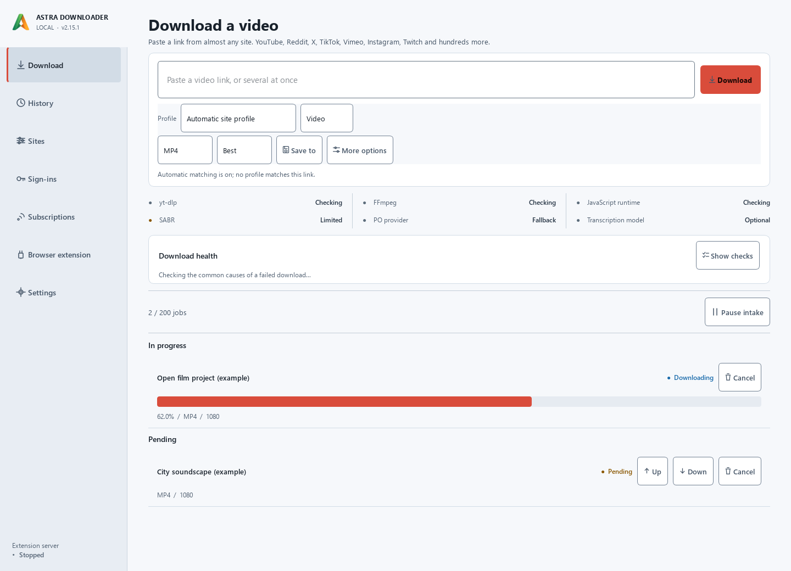

# Astra Downloader v2.15.1

[](https://github.com/SysAdminDoc/AstraDownloader/releases/tag/v2.15.1) [](LICENSE) [](https://github.com/SysAdminDoc/AstraDownloader/releases/latest)

Save videos and audio without building a command line. Astra Downloader puts yt-dlp in a Windows desktop app, with format choices, a persistent queue and searchable download history.

Use it on its own. The optional [Astra Deck extension](https://github.com/SysAdminDoc/Astra-Deck) can also send links from your browser.



*The packaged app, captured offscreen with seeded example jobs. No account or browser session was used. These screenshots demonstrate the interface, not download speed or site availability.*

## Download

Choose a Windows x64 package from the [v2.15.1 release](https://github.com/SysAdminDoc/AstraDownloader/releases/tag/v2.15.1).

| Package | Use it when |
| --- | --- |
| [AstraDownloader.exe](https://github.com/SysAdminDoc/AstraDownloader/releases/download/v2.15.1/AstraDownloader.exe) | You want a per-user installation with desktop and Start Menu entries. No separate installer. |
| [AstraDownloader-onedir.zip](https://github.com/SysAdminDoc/AstraDownloader/releases/download/v2.15.1/AstraDownloader-onedir.zip) | You want a portable folder. Extract it somewhere writable, then run the executable inside. |

The app downloads its managed yt-dlp and FFmpeg tools during first-run setup. YouTube may also need a JavaScript runtime. Internet access is required; neither download includes an offline-ready tool bundle.

These Windows builds are unsigned. Check the SHA-256 against the matching sidecar on the release page **before running the file**. A matching hash checks the downloaded bytes; it isn't a publisher signature.

```powershell
Get-FileHash .\AstraDownloader.exe -Algorithm SHA256
```

For the portable ZIP, compare its hash with `AstraDownloader-onedir.zip.sha256` instead. If your security software reports a problem, stop and investigate it.

## Your first download

1. Open the app, finish tool setup and confirm a download folder.
2. Paste a video link you have permission to download. Choose video or audio, then a format and quality.
3. Start the download. Watch the queue, then find the finished file in History.

The link's available formats determine what you can select. Choosing 2160p doesn't create a 4K version of a lower-resolution source.



*First-run view from the same packaged build, using a disposable profile.*

## More control when you need it

- **Choose the output.** MP4, MKV or WebM for video. Extract MP3, M4A, Opus, FLAC or WAV audio. Set a filename or save a timestamp range.
- Paste a batch, bound a playlist, or keep an eye on the persistent queue. Failed jobs retain their error and recovery guidance.
- **Keep an archive.** Search History, schedule subscriptions, or save optional thumbnails and metadata sidecars for a media library.
- Subtitles can come from the source or its automatic captions. Optional local Whisper transcription can produce an SRT when a downloaded video has no subtitle track.
- **Set defaults per site.** Profiles can select formats and pacing. The separate Sign-ins page manages imported cookies or supported site credentials.
- Dark and light themes are built in. Network settings include proxies, IP preferences and browser impersonation where yt-dlp supports it.

The [user guide](docs/USER_GUIDE.md) covers these controls, portable storage, updates and removal.



*The built-in catalogue in this review profile. Installing yt-dlp adds its extractor list. A listing is not a guarantee that every video on that site will download.*



## Supported sites and limits

Astra Downloader uses [yt-dlp's extractors](https://github.com/yt-dlp/yt-dlp/blob/master/supportedsites.md). Site changes, account requirements and regional restrictions can affect a particular link. The Sites page offers guidance, and the Download page reports missing or outdated tools.

Only download material you're entitled to save. The app doesn't grant access to paid content or remove DRM. Sign-ins can help with content your account already has access to, but they don't guarantee success. Read [yt-dlp's account and cookie guidance](https://github.com/yt-dlp/yt-dlp/wiki/Extractors#exporting-youtube-cookies) before importing a YouTube session.

Local transcription is optional and needs a separate model download. SponsorBlock is also optional and contacts its service when used. No third-party site, private account download or browser pairing is promised by the screenshots above.

## Where your data goes

The installed app keeps state in `%LOCALAPPDATA%\AstraDownloader`. A new portable folder keeps it under `data` beside its executable. That includes settings, queue, history and stored sign-ins. Media goes to your chosen output folders.

Cookies are filtered to the selected site's registrable domain. yt-dlp receives them when needed and can send them to that site. The interface and local API expose sign-in metadata, not the stored secrets. Settings exports omit cookies and credentials. A site username or password passed to yt-dlp can be visible to another process running as your Windows user.

The local API uses loopback addresses and session-token checks. Download URL checks reject explicit private or local IP targets and embedded credentials, but **they are not a network sandbox**: DNS results and redirects can still reach addresses those checks don't resolve. See the [threat model](docs/yt-dlp-cookie-threat-model.md) and [security policy](SECURITY.md).

## Run or build from source

Python 3.11+ is the source runtime floor. The release build uses Python 3.13 on Windows x64.

```powershell
py -3.13 -m venv .venv
.\.venv\Scripts\python.exe -m pip install --require-virtualenv -r astra_downloader/requirements.txt
.\.venv\Scripts\python.exe astra_downloader/astra_downloader.py
```

Dependencies aren't installed during import. [Building and verification](docs/BUILDING.md) covers the pinned release environment, both package layouts and the local checks.

## License and project files

Astra Downloader's code is [MIT licensed](LICENSE). Bundled libraries and downloaded helpers keep their own licenses. Each release includes dependency provenance; the [license policy](astra_downloader/license-policy.json) records the package requirements. The portable layout leaves Qt libraries replaceable.

[Changelog](CHANGELOG.md) · [Roadmap](ROADMAP.md) · [Report a problem](https://github.com/SysAdminDoc/AstraDownloader/issues) · [Brand concepts and original captures](assets/concepts/2026-09-09-marketing/README.md)
